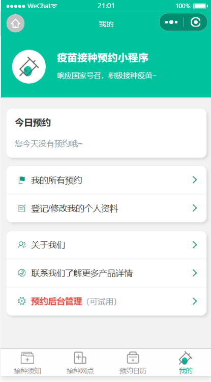
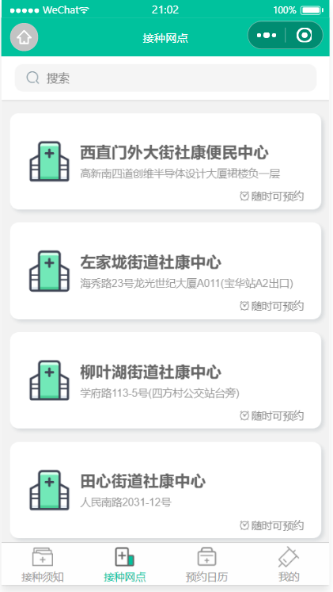
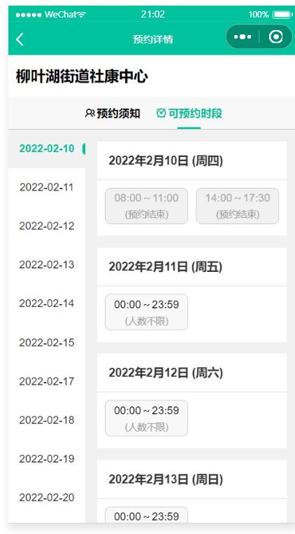
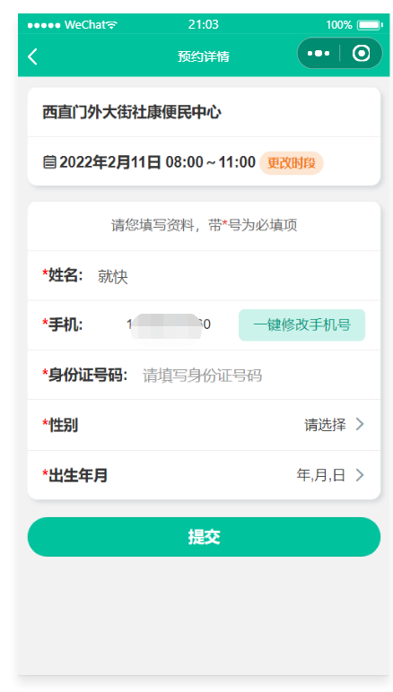
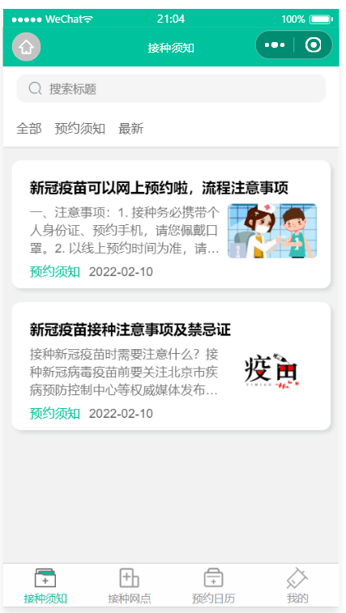

### 项目介绍

- 疫苗预约小程序，各类医疗机构运用数字化手段，提高疫苗接种效率，以帮助用户节省时间
- 线上疫苗预约的简单方便，如果疫苗暂时缺货，可以先订阅等通知，等疫苗到库后再去预约，非常方便

### 特点

- 无广告：本项目希望通过微信小程序，构建一款无广告，真实可靠的毕业校友通讯录。
- 简约：只做最基础功能，不臃肿，主打内容极简，功能简洁直击痛点
- 安全：保护校友的信息安全，隐私内容需要申请后可见。
- 方便：上传自己的个人信息，方便在需要时取得联系。小程序无需下载APP随用随走。

### 技术使用

- 项目使用微信小程序平台进行开发。
- 使用腾讯云开发技术，免费资源配额， 无需域名和服务器即可搭建。
- 小程序本身的即用即走，适合小工具的使用场景，也适合程序的开发。

### 项目效果截图

  

